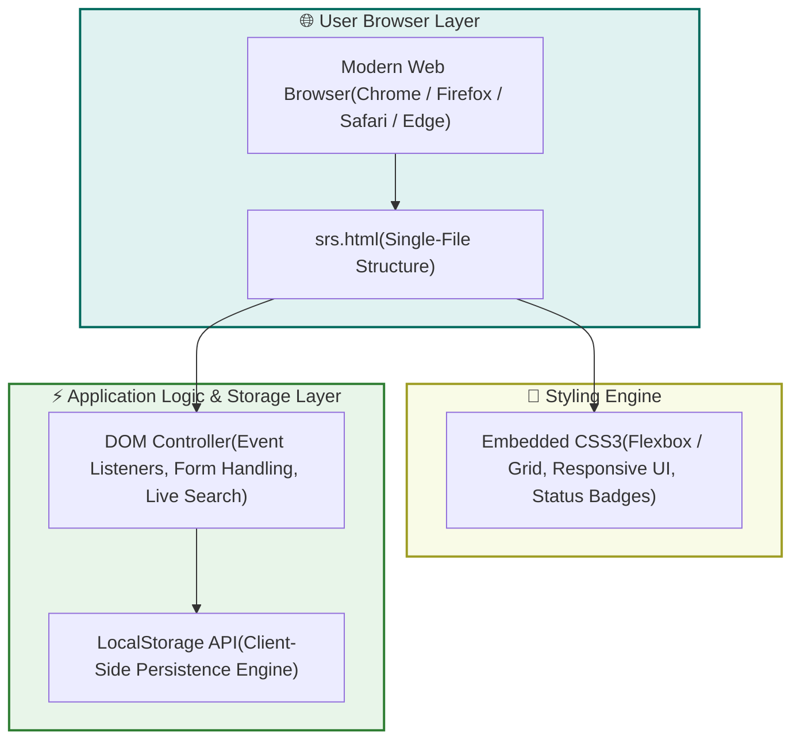

# 🎓 Student Record Management System

https://readme-typing-svg.demolab.com?font=Poppins&weight=600&size=26&duration=3000&pause=1000&color=38BDF8&center=true&vCenter=true&width=750&lines=Pure+HTML5,+CSS3+%26+JavaScript;Student+Profiles+and+Performance+Metrics;Zero+Dependencies+%26+LocalStorage+Persistence" alt="Student Record Management System Typing SVG" />

### 🤖 *A lightweight, modern web-based application designed to manage student profiles, academic records, and performance metrics*


[](LICENSE)

---

**Manage student profiles, academic records, and performance metrics effortlessly with offline client-side persistence! 📚✏️**

[📖 About](#-about-the-project) • [🛠️ Technologies](#️-technologies-used) • [✨ Features](#-features) • [🏗️ Architecture](#-system-architecture) • [🚀 Quick Start](#-how-to-run)


---

## 📖 About the Project

**Student Record Management System** is a lightweight, self-contained single-file web application (`srs.html`). Built using pure front-end web technologies, this application offers an intuitive interface to add, search, view, and manage student details with offline persistence.

> [!NOTE]  
> **🎯 Mission:** To provide a fast, responsive, and easy-to-use client-side dashboard for tracking student academic records without needing an external server or database.

---

## 🛠️ Technologies Used


| Technology | Purpose |
| :--- | :--- |
| **HTML5** | Application markup, semantic structure, and form validation controls. |
| **CSS3** | Modern responsive design, flexbox/grid layout, custom styling, and visual badge indicators. |
| **JavaScript (ES6+)** | DOM manipulation, state management, real-time search filtering, and LocalStorage interaction. |
| **Browser LocalStorage API** | Client-side persistent data storage without requiring an external database. |


---

## ✨ Features

* **Student Registration:** Add new students with fields for Full Name, Roll Number, Academic Branch, and Performance Marks.
* **Pass/Fail Auto-Calculation:** Automatically determines pass or fail status based on standard academic thresholds ($\ge 40\%$).
* **Real-time Live Search:** Filter student records dynamically by **Name**, **Roll Number**, or **Branch**.
* **Data Persistence:** All records are automatically saved in the browser's `localStorage` to ensure data isn't lost on page reload.
* **Duplicate Roll Number Protection:** Prevents duplicate entries using roll number verification logic.
* **Fully Responsive:** Styled using standard CSS Grid and Flexbox for seamless display on desktops, tablets, and mobile devices.

---

## 🏗️ System Architecture



---

## 📁 Repository Structure

```text
student-record-system/
│
├── 📄 srs.html        # Single-file implementation containing HTML, CSS, and JS
└── 📄 README.md       # Project documentation
```

---

## 🚀 How to Run

### 1️⃣ Direct Browser Execution (Recommended)
1. Save the code into a file named `srs.html`.
2. Double-click the file to open it instantly in any web browser (Chrome, Edge, Firefox, Safari).
3. No servers, node modules, or internet access required! 📚✏️

---

## 👨‍💻 Community & Support

### 🌟 Show Your Support
If you find this Student Record Management System helpful for your academic or administrative tracking needs, please consider giving this project a star!

---

*🎓 Student Record Management System: Lightweight, Fast, and Persistent!*  
*© 2026 Academic Tech Lab | Built with Pure HTML, CSS & JavaScript*
